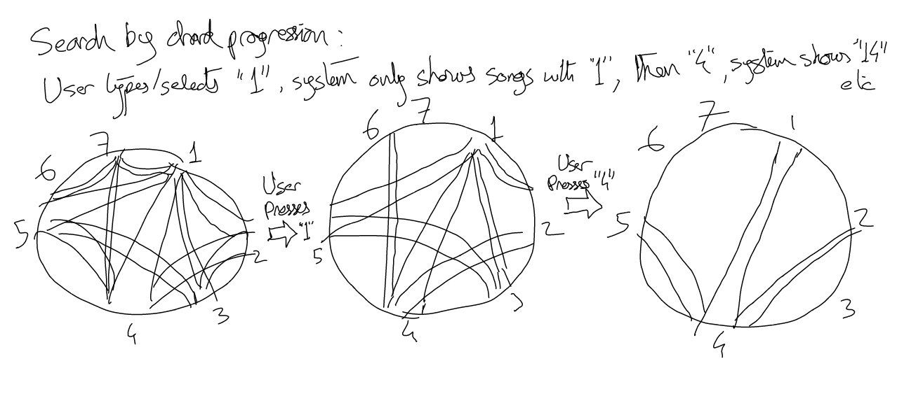
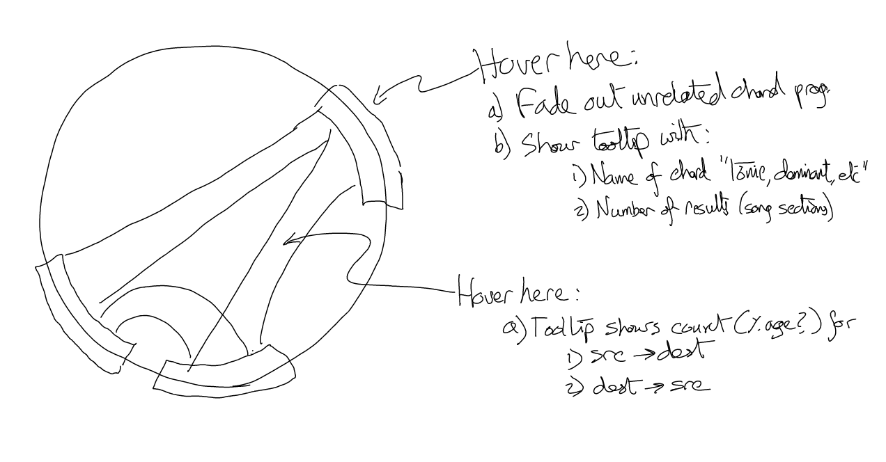
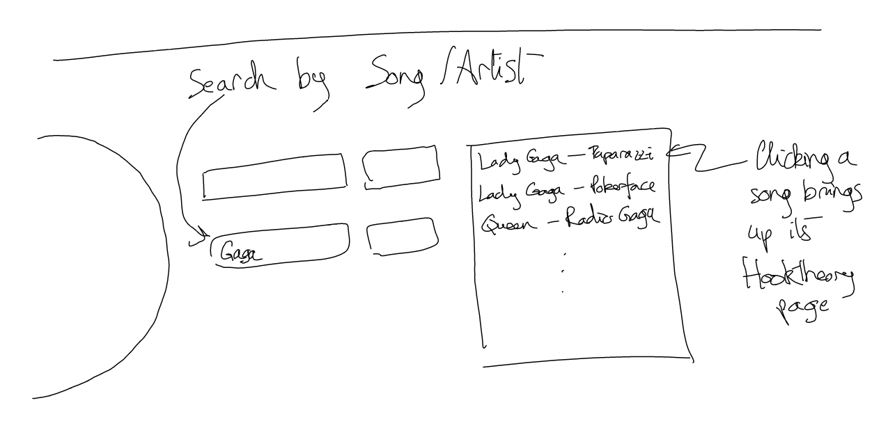
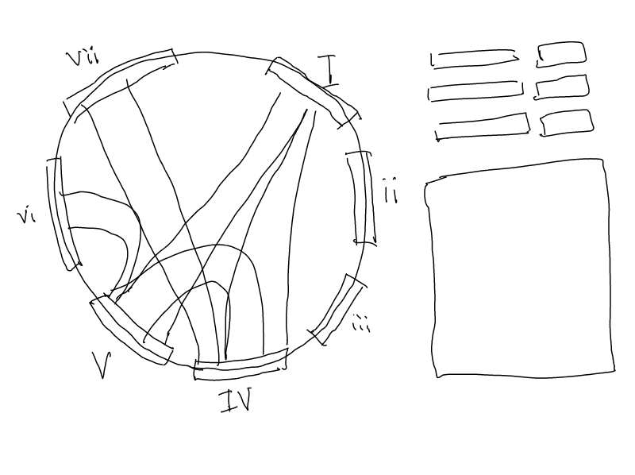
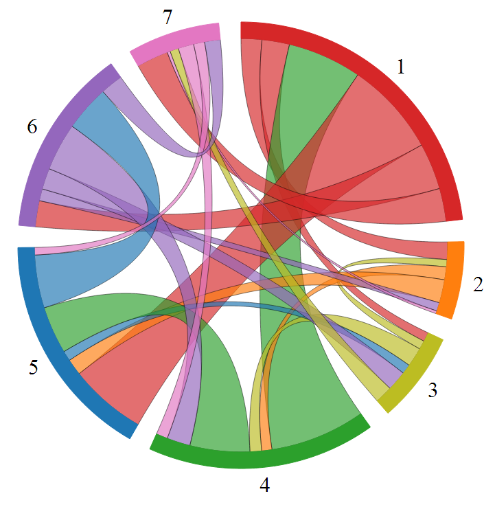

a3-edbutler-piscean
===================

Description and Storyboard
----------

We chose to create a vizualization to explore chord progressions in songs. Which kinds of progressions are common, which songs use certain progressions, what do progression typically look like for certain artists or genres? Though a comprehensive database of chord progressions in popular music does not exist, twe found a webiste whose owners were kind enough to share their database of segments from a couple thousand songs, created by crowdsourced analysis.

They have done [these static visualizations](http://www.hooktheory.com/blog/i-analyzed-the-chords-of-1300-popular-songs-for-patterns-this-is-what-i-found/) from [www.hooktheory.com](http://www.hooktheory.com) in the past. Additionally, the site already provides [an global visualization](http://www.hooktheory.com/) of this data, that allows users to crawl through chord progression prefixes and find matching songs, with links to [song-specific visualizations](http://www.hooktheory.com/analysis).

In contrast, rather than visualizing only the chord prefixes, we wanted to create a aggregate visualization of chord progressions, showing the general way chords flow throughout the song. Specifically, we want to take a group a songs, count the number of transitions between certain chords (e.g., I -> IV, V -> I), and visualize the relative frequencies of these transitions. Since our data consists of a double-directed graph (whose nodes also naturally form a circle), a [chord diagram](http://bl.ocks.org/mbostock/4062006) seems like an appropriate encoding.

The primary use we wish to facilitate is viewing of chord progression trends for songs in different genres, by different artists, or with different chord progression subsequences. Therefore, filtering is the most important interaction technique. The user can enter queries (e.g., songs that contain a I-IV-V-I progression), and the chord diagram will animate to a new chord diagram that shows data only for songs matching the criteria, as shown below.

To help with viewing an individual diagram, the chord will support viewing a single group at a time and additional pop-up details. When the user hovers over a group, it will fade out the other groups. When the user hovers over groups or chords, tooltips will show the data for those elements.

So that the user can futher drill-down into individual songs, we show a list of all songs matching the current search criteria, and provide links to Hooktheory's interative visualizations of the individual songs. These visualization allow the user to see and hear the chord progression of a specific song. Our chart shows an aggregation of chord progression, so it's not possible for the user to see any individual sequences. This feature that provides links to visuzliations of individual sequences helps overcome shortcomings in our visualization.

Here's a sketch of the overall interface. Visualization of the current selection is the chord diagram on the left. The right side provides text boxes in which to enter search queries, and the large text area provides links to songs that match the search criteria. This filtering will happne live as the user types in the search box.

Here's a static visualization of the full dataset. We arrange the hues for each node in a color circle to emphasize the circular nature of the nodes. Rather than viewing all possible types of chords (e.g., V vs. V7 vs. Vsus4), we collapse all chords to the mode of their root (the numbers 1-7) and remove self-transitions.

